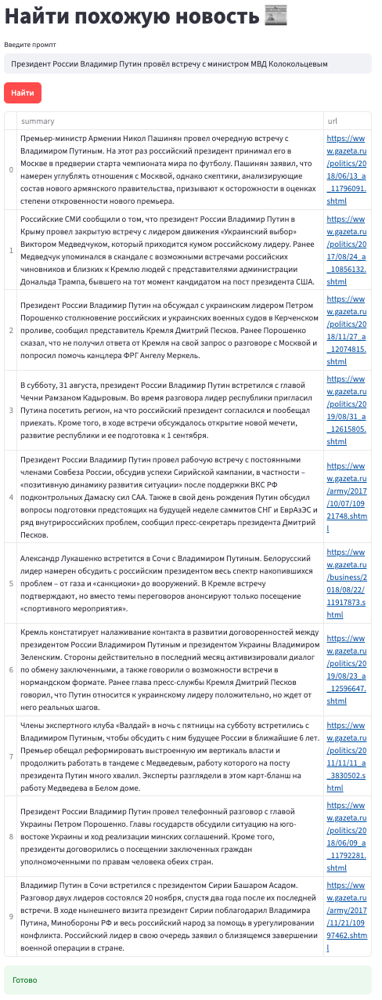
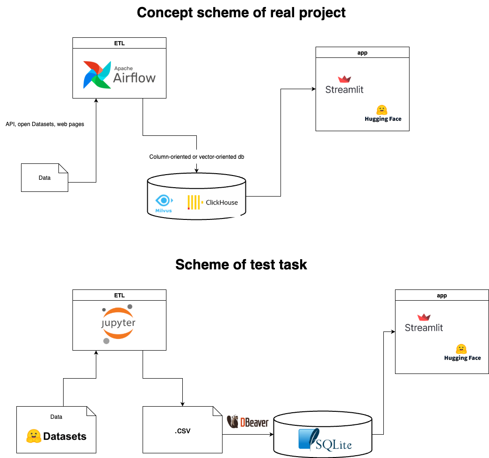

# News searcher
****
## Examples



****

## How to run
****
1. Download file https://disk.360.yandex.ru/d/Fw6220MKmDEWLg and put into directroy
2. run ```docker compose up -d```
****
*.env file doesn't contain any secret information thats why its replaced in repository*
****

## Why was these technologies choosen?
Python is main ML language today and contains many ML libraries and frameworks. Streamlit is low-code framework. Its good choice to create applet to demonstrait work of an ML pipelines or to create a little website for ML pipeline without westing time on web page layout and styles. sqlite3 - DBMS that is presented by one file. It was choosen thanks to itself simplicity. Just what you need to test tasks. In real project I think best choice in this case is vector-oriented DBMS or column-oriented DBMS. Also you should esteblish ETL pipeline in real project. For this task I would choose Apache airflow. But in this test task it just a jupyter notebook file with extract and transform data. After data was saved into csv file and loaded to db with DBeaver. 


